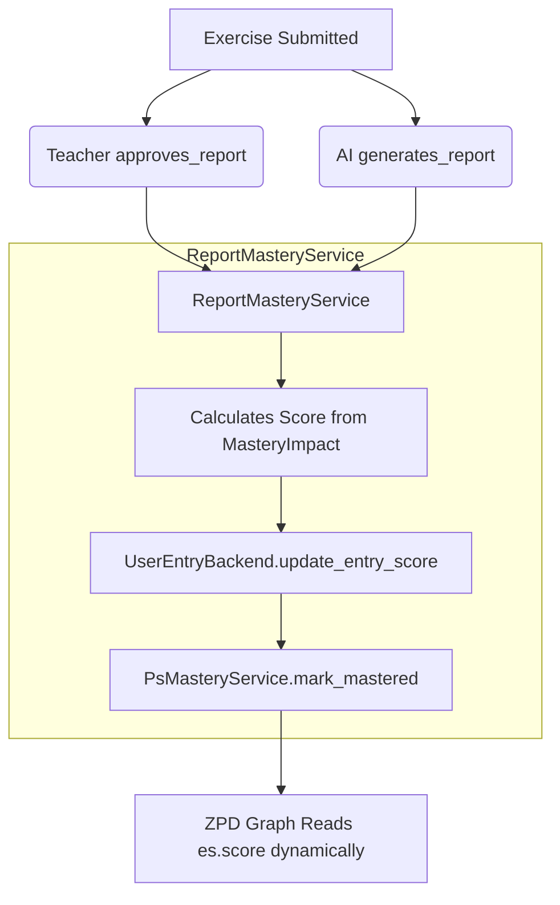

# Report Mastery Architecture

The `ReportMasteryService` is the explicit mechanism that propagates mastery outcomes from generated Entry Reports back into the student's learning graph. It isolates and unifies the rule that dictates how student feedback interacts with the Zone of Proximal Development (ZPD).

## The Problem

Previously, mastery capabilities were underspecified and implicit:
- Both `TeacherReviewService.approve_report` and `EntryReportService.generate_report` directly called the `PsMasteryService` within unstructured side effects.
- Crucially, the outcome's evaluation metric—the `assessment_score` and the `score` evaluated by the teacher or AI within an Entry Report—were bypassed completely during mastery propagation.
- Because the overarching progress was tracked manually without explicit storage, the ZPD (computed dynamically using Cypher queries involving `max(coalesce(es.score, 0.0))`) never received the updated scores, stalling the learner's actual growth state.

## The Solution: Explicit Propagation

`ReportMasteryService` resolves the disconnect between report generation and ZPD resolution by introducing an explicit loop closure service method: `propagate_mastery()`.

Instead of passively accepting side effects, report generating services—like `TeacherReviewService` and `EntryReportService`—intercept the implicit process by executing `ReportMasteryService.propagate_mastery(...)` immediately upon determining the `MasteryImpact` of an exercise.

### How it Works

The single `propagate_mastery()` pipeline conducts three fundamental steps:
1. **Explicit Scoring Evaluation**: Uses the semantic definition of the exercise's `MasteryImpact` to construct either the rigorous Teacher Score or the flexible AI Score.
2. **Explicit Node Recording**: Writes the calculated float evaluation score back onto the submission node — a `:UserEntry` still matched by `entity_type = 'exercise_submission'` — in Neo4j (via `UserEntryBackend.update_entry_score`).
3. **Explicit Mastery Declaration**: Applies the resulting evaluation through `PsMasteryService.mark_mastered()`, publishing the mastery events throughout the remainder of the event stream using an honest score that correctly feeds the ZPD.

## Implementation Semantics 

### Teacher Evaluations
When a teacher explicitly passes a student (`approve_report`), the implementation captures the strict `get_teacher_score()` defined by the semantic `MasteryImpact` parameter on the target `Exercise`. The teacher guarantees the score's rigor, bypassing the need for an arbitrary integer sliding scale directly inputted per review.

### AI Evaluations
When an AI implicitly evaluates a student's personal feedback via `generate_report`, the implementation falls back directly onto the looser `get_ai_score()`. 

Through this dual-channel unification, `ReportMasteryService` ensures both that human/AI models share an explicit, scalable relationship, and that the Zone of Proximal Development can track a non-degenerative graph state dynamically.
