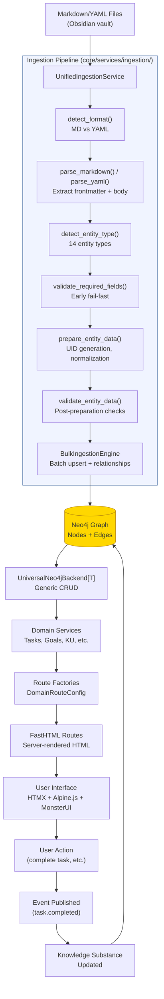
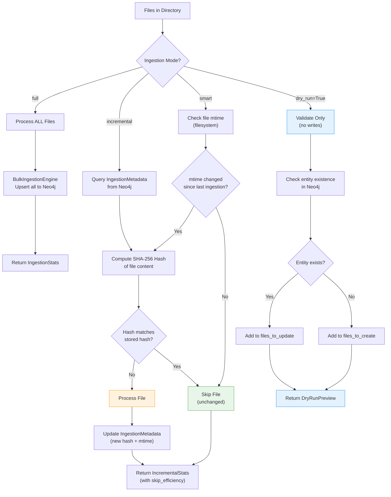
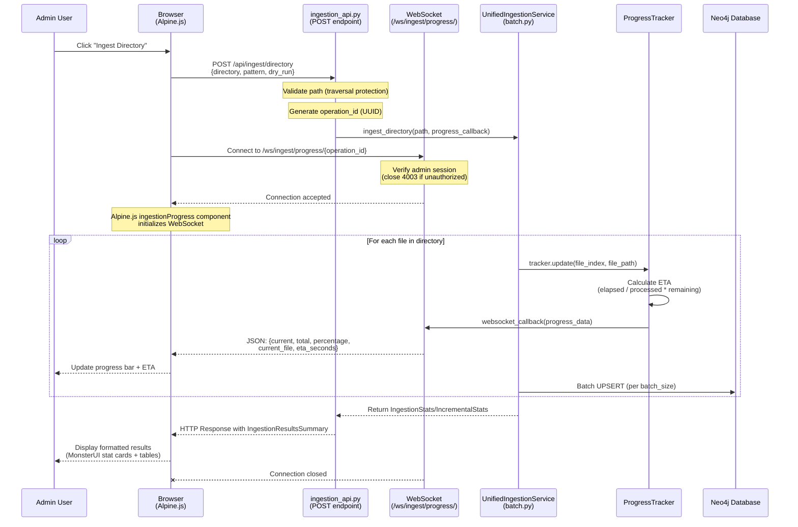
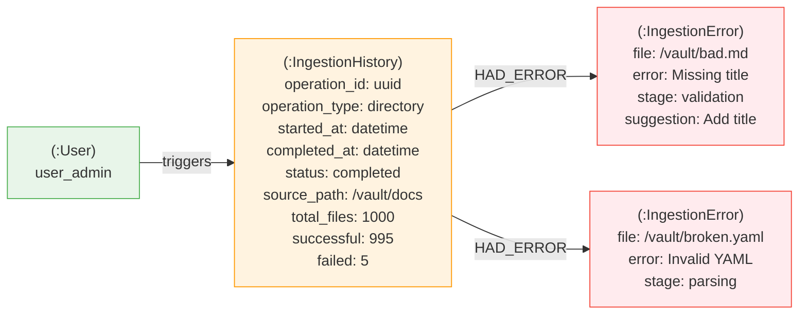
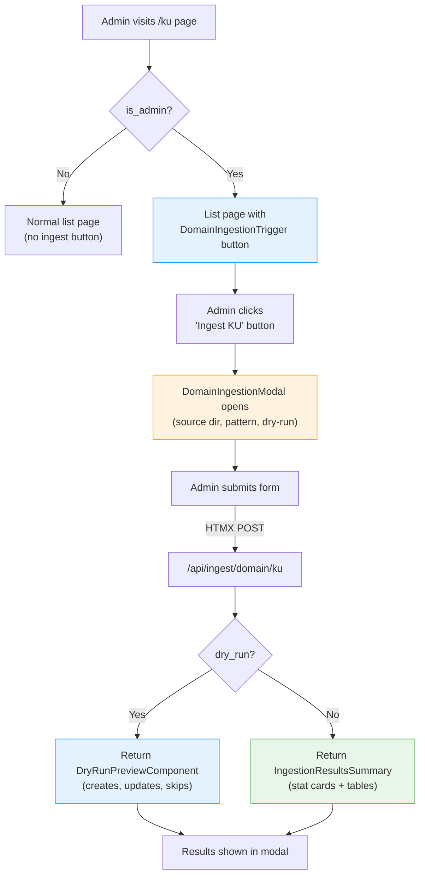

# Ingestion System Architecture Diagrams

**Last Updated:** 2026-02-06

Visual architecture diagrams for SKUEL's MD/YAML → Neo4j ingestion system.

**See:** `/docs/architecture/CORE_SYSTEMS_ARCHITECTURE.md` for full context.

---

## 1. Data Flow: Markdown → Neo4j → UX

The complete pipeline from human-written content to user-facing interface.



---

## 2. Ingestion Modes Decision Flow

How the system decides which files to process based on ingestion mode.



### Ingestion Modes Comparison

| Mode | Speed | Use Case | Return Type | Writes to DB |
|------|-------|----------|-------------|--------------|
| **Full** | Slowest | First ingestion, clean slate | `IngestionStats` | Yes |
| **Incremental** | Fast | Regular ingestion, large vaults | `IncrementalStats` | Yes (changed only) |
| **Smart** | Fastest | Frequent ingestion, optimization | `IncrementalStats` | Yes (changed only) |
| **Dry-Run** | Fast | Preview before execution | `DryRunPreview` | No |

---

## 3. WebSocket Real-Time Progress Architecture

Sequence diagram showing how real-time ingestion progress flows from backend to UI.



### Progress Data Format

```json
{
  "current": 150,
  "total": 1000,
  "percentage": 15.0,
  "current_file": "/vault/docs/ku.machine-learning.md",
  "eta_seconds": 85
}
```

### Key Components

| Component | File | Role |
|-----------|------|------|
| `ProgressTracker` | `core/services/ingestion/progress_tracker.py` | Calculates progress + ETA, calls callback |
| `broadcast_progress()` | `adapters/inbound/ingestion_api.py` | Sends JSON to WebSocket connection |
| `_active_connections` | `adapters/inbound/ingestion_api.py` | Global dict mapping operation_id to WebSocket |
| `ingestionProgress` | `static/js/skuel.js` | Alpine.js component, auto-connects WebSocket |
| `ProgressIndicator` | `ui/patterns/ingestion_results.py` | Server-rendered HTML with Alpine.js bindings |

---

## 4. Ingestion History Graph Model

How ingestion operations are tracked as Neo4j nodes for audit trail.



### IngestionHistoryService API

```python
from core.services.ingestion import IngestionHistoryService

history = IngestionHistoryService(driver)

# Create entry before ingestion
op_id = await history.create_entry("directory", "user_admin", "/vault/docs")

# Update with results
await history.update_entry(op_id, "completed", stats_dict, error_dicts)

# Retrieve history (paginated)
entries = await history.get_history(limit=50, offset=0)

# Get specific entry
entry = await history.get_entry(operation_id)

# Total count (for pagination)
total = await history.get_total_count()
```

---

## 5. Domain-Integrated Ingestion Trigger Flow

How admin users trigger ingestion from domain list pages.



### Supported Domains

| Domain | API Endpoint | Default Source |
|--------|-------------|----------------|
| KU | `/api/ingest/domain/ku` | `/home/mike/0bsidian/skuel/docs/ku` |
| LS | `/api/ingest/domain/ls` | `/home/mike/0bsidian/skuel/docs/ls` |
| LP | `/api/ingest/domain/lp` | `/home/mike/0bsidian/skuel/docs/lp` |
| Tasks | `/api/ingest/domain/tasks` | `/home/mike/0bsidian/skuel/docs/tasks` |
| Goals | `/api/ingest/domain/goals` | `/home/mike/0bsidian/skuel/docs/goals` |
| Habits | `/api/ingest/domain/habits` | `/home/mike/0bsidian/skuel/docs/habits` |
| Events | `/api/ingest/domain/events` | `/home/mike/0bsidian/skuel/docs/events` |
| Choices | `/api/ingest/domain/choices` | `/home/mike/0bsidian/skuel/docs/choices` |
| Principles | `/api/ingest/domain/principles` | `/home/mike/0bsidian/skuel/docs/principles` |

---

## Related Documentation

- **Architecture:** `/docs/architecture/CORE_SYSTEMS_ARCHITECTURE.md`
- **Implementation Guide:** `/docs/patterns/UNIFIED_INGESTION_GUIDE.md`
