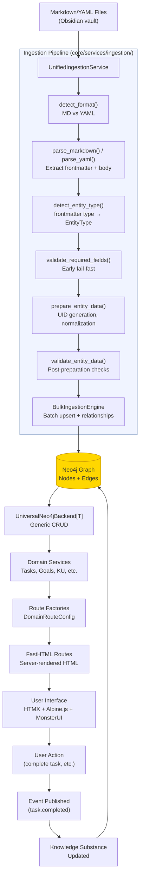
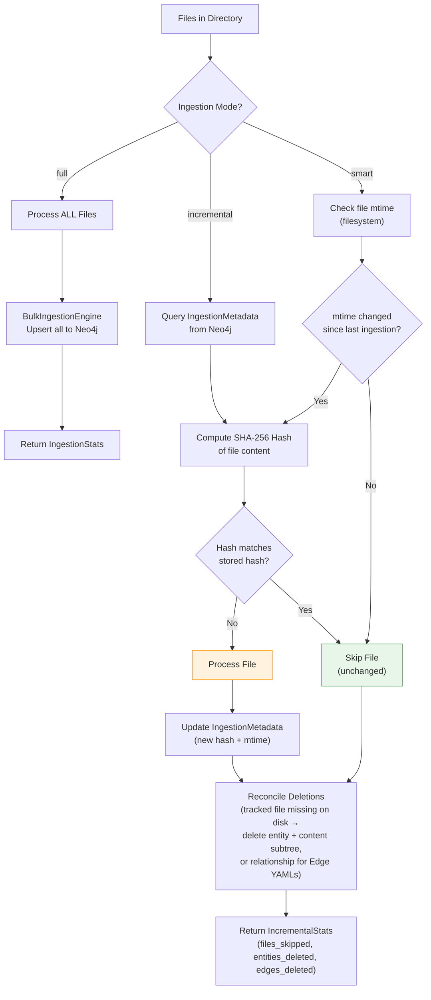
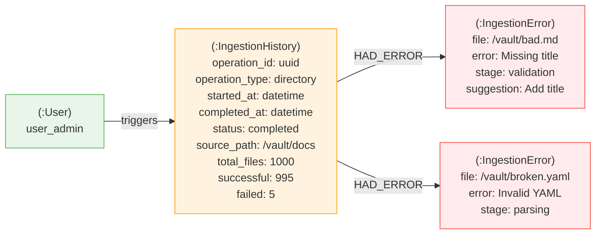

# Ingestion System Architecture Diagrams

**Last Updated:** 2026-09-21

Visual architecture diagrams for SKUEL's MD/YAML → Neo4j ingestion system.

**See:** `/docs/architecture/CORE_SYSTEMS_ARCHITECTURE.md` for full context.

---

## 1. Data Flow: Markdown → Neo4j → UX

The complete pipeline from human-written content to user-facing interface.


```mermaid
flowchart TD
    A["Markdown/YAML Files<br/>(Obsidian vault)"] --> B["UnifiedIngestionService"]

    subgraph Ingestion["Ingestion Pipeline (core/services/ingestion/)"]
        B --> C["detect_format()<br/>MD vs YAML"]
        C --> D["parse_markdown() / parse_yaml()<br/>Extract frontmatter + body"]
        D --> E["detect_entity_type()<br/>frontmatter type → EntityType"]
        E --> F["validate_required_fields()<br/>Early fail-fast"]
        F --> G["prepare_entity_data()<br/>UID generation, normalization"]
        G --> H["validate_entity_data()<br/>Post-preparation checks"]
        H --> I["BulkIngestionEngine<br/>Batch upsert + relationships"]
    end

    I --> J[("Neo4j Graph<br/>Nodes + Edges")]

    J --> K["UniversalNeo4jBackend[T]<br/>Generic CRUD"]
    K --> L["Domain Services<br/>Tasks, Goals, KU, etc."]
    L --> M["Route Factories<br/>DomainRouteConfig"]
    M --> N["FastHTML Routes<br/>Server-rendered HTML"]
    N --> O["User Interface<br/>HTMX + Alpine.js + MonsterUI"]

    O --> P["User Action<br/>(complete task, etc.)"]
    P --> Q["Event Published<br/>(task.completed)"]
    Q --> R["Knowledge Substance<br/>Updated"]
    R --> J

    style Ingestion fill:#f0f4ff,stroke:#4a6fa5
    style J fill:#ffd700,stroke:#b8860b
```

---

## 2. Ingestion Modes Decision Flow

How the system decides which files to process based on ingestion mode.


```mermaid
flowchart TD
    A["Files in Directory"] --> B{"Ingestion Mode?"}

    B -->|"full"| C["Process ALL Files"]
    B -->|"incremental"| D["Query IngestionMetadata<br/>from Neo4j"]
    B -->|"smart"| E["Check file mtime<br/>(filesystem)"]

    %% Full mode
    C --> G["BulkIngestionEngine<br/>Upsert all to Neo4j"]
    G --> H["Return IngestionStats"]

    %% Incremental mode
    D --> I["Compute SHA-256 Hash<br/>of file content"]
    I --> J{"Hash matches<br/>stored hash?"}
    J -->|"Yes"| K["Skip File<br/>(unchanged)"]
    J -->|"No"| L["Process File"]
    L --> M["Update IngestionMetadata<br/>(new hash + mtime)"]
    M --> R["Reconcile Deletions<br/>(tracked file missing on disk →<br/>delete entity + content subtree,<br/>or relationship for Edge YAMLs)"]
    K --> R
    R --> N["Return IncrementalStats<br/>(files_skipped, entities_deleted, edges_deleted)"]

    %% Smart mode
    E --> O{"mtime changed<br/>since last ingestion?"}
    O -->|"No"| K
    O -->|"Yes"| I

    style K fill:#e8f5e9,stroke:#4caf50
    style L fill:#fff3e0,stroke:#ff9800
```

### Ingestion Modes Comparison

| Mode | Speed | Use Case | Return Type | Writes to DB |
|------|-------|----------|-------------|--------------|
| **Full** | Slowest | First ingestion, clean slate | `IngestionStats` | Yes |
| **Incremental** | Fast | Regular ingestion, large vaults | `IncrementalStats` | Yes (changed only) |
| **Smart** | Fastest | Frequent ingestion, optimization | `IncrementalStats` | Yes (changed only) |

**`force=True` (orthogonal flag on incremental/smart, force ≠ full):** skips the
hash/mtime check above — every surviving file takes the "Process File" path — while
metadata updates and deletion reconciliation still run. The sanctioned
re-chunk/migration path; a `full`+`force` request is coerced to `smart`.

**Preview** is not an `ingest_directory` mode: `VaultReconciler.preview` (`./dev
vault-sync --preview`, the personal "Preview sync" button) reports would-ingest /
would-delete over the same scan, nothing written.
See `docs/patterns/UNIFIED_INGESTION_GUIDE.md § Ingestion Modes`.

---

## 3. Ingestion History Graph Model

How ingestion operations are tracked as Neo4j nodes for audit trail.


```mermaid
graph LR
    Admin["(:User)<br/>user_admin"] -->|"triggers"| SH

    SH["(:IngestionHistory)<br/>operation_id: uuid<br/>operation_type: directory<br/>started_at: datetime<br/>completed_at: datetime<br/>status: completed<br/>source_path: /vault/docs<br/>total_files: 1000<br/>successful: 995<br/>failed: 5"]

    SH -->|"HAD_ERROR"| E1["(:IngestionError)<br/>file: /vault/bad.md<br/>error: Missing title<br/>stage: validation<br/>suggestion: Add title"]

    SH -->|"HAD_ERROR"| E2["(:IngestionError)<br/>file: /vault/broken.yaml<br/>error: Invalid YAML<br/>stage: parsing"]

    style SH fill:#fff3e0,stroke:#ff9800
    style E1 fill:#ffebee,stroke:#f44336
    style E2 fill:#ffebee,stroke:#f44336
    style Admin fill:#e8f5e9,stroke:#4caf50
```

### IngestionHistoryService API

```python
from core.services.ingestion import IngestionHistoryService

history = IngestionHistoryService(driver)

# Create entry before ingestion
op_id = await history.create_entry("directory", "user_admin", "/vault/docs")

# Update with results
await history.update_entry(op_id, "completed", stats_dict, error_dicts)

# Retrieve history (paginated)
entries = await history.get_history(limit=50, offset=0)

# Get specific entry
entry = await history.get_entry(operation_id)
```

---

## Related Documentation

- **Architecture:** `/docs/architecture/CORE_SYSTEMS_ARCHITECTURE.md`
- **Implementation Guide:** `/docs/patterns/UNIFIED_INGESTION_GUIDE.md`
