# UI Orchestrator Pattern

**Status:** Active | **Last Updated:** 2026-04-13

## Related Skills

For implementation guidance, see:
- [@fasthtml](../../.claude/skills/fasthtml/SKILL.md)
- [@ui-orchestrator](../../.claude/skills/ui-orchestrator/SKILL.md)

## Overview

**What:** An Application Facade (Orchestrator) pattern specifically built to serve a complex UI view or Hub page.

**Why:** Resolves the "Dependency Gravity" problem where backend-rendered routes (like FastHTML) must assemble data from 5-10 different micro-services to render a single complex page. Without an orchestrator, the route files become bloated Service Locators or require massive dependency-injection signatures, violating Clean Architecture and polluting the HTTP layer with business logic.

**Impact:** Strips out inline business logic (like terminal state filtering, concurrent data aggregation, and cross-domain priority sorting) from the UI layer. Reduces the number of injected services in UI router files from N (often 6-10) down to 1 (`orchestrator`).

## Adoption

| Orchestrator | Hub / Routes | Services Consolidated | Key Wins |
|---|---|---|---|
| `AdminOrchestrator` | `admin_dashboard_ui.py` | 3 → 1 | Eliminated repeated `_get_system_status(services)` helper across 4 routes; `get_analytics_data()` collapses two service calls into one |
| `ProfileOrchestrator` | `user_profile_ui.py` | 9 → 1 | Terminal-state filtering, priority sorting |
| `UserEntryOrchestrator` | `user_entry_routes.py` + 4 sub-factories | 9 → 1 | Successor to the former Submissions + Journal orchestrators (ADR-054 Commit 5c); eliminated multi-factory injection. `get_entry_report_view()` collapses fetch → access check → revision lookup; `get_entry()` backs ownership-verified journal download |
| `ExploreOrchestrator` | `explore_ui.py` (API + UI factories) | 5 → 1 | Absorbed 80-line concurrent loader + 90-line Vis.js graph builder + sidebar data aggregation (`get_sidebar_data`) |
| `LibraryOrchestrator` | `library_ui.py` | 6 → 1 | Deduplicated multi-step pin/enroll queries |
| `TeacherOrchestrator` | `teaching_ui.py` | 4 → 1 | Review queue, student list, groups, KU detail under one facade |
| `ActivityReviewOrchestrator` | `activity_review_ui.py` | 4 → 1 | Collapses ActivityReportOperations + ReviewQueueOperations + UserService + UserContextBuilder; context_builder gracefully degrades when unavailable |
| `PathwaysOrchestrator` | `pathways_ui.py` | 3 → 1 | Wraps LpService with UserProgressService injection; routes never reference user_progress directly |
| `LateralRelationshipsOrchestrator` | `lateral_routes.py` | 7 → 1 | Absorbed `_create_relationship` / `_get_relationships` module-level helpers; routes extract `user_uid` themselves and delegate; `lateral_service` property exposes the raw service for `LateralRouteFactory` construction |
| `CalendarOptimizationOrchestrator` | `advanced_routes.py` | 3 → 1 | Absorbed tasks/events fetch + coordination; `api_related_services` eliminated from `ADVANCED_CONFIG` |

All orchestrators live in `app/core/orchestrator/` and are registered in `services_bootstrap/_container.py`.

## The Pattern

### Core Components

1. **Application Orchestrator Layer** (`app/core/orchestrator/`): Highly specific classes designed to serve a unique, specialized UI page.
2. **Dependency Aggregation**: The Orchestrator ingests all base-level domain services at application bootstrap.
3. **Route Simplification**: UI Routers only accept the Orchestrator, removing the need to pull raw domain services from the `Services` container.

### Architecture

```mermaid
graph TD
    subgraph "Route Layer (Thin)"
        UI_Routes["UI Routes / Factories"]
    end

    subgraph "Orchestrator Layer (Facades)"
        AO[AdminOrchestrator]
        PO[ProfileOrchestrator]
        UEO[UserEntryOrchestrator]
        EO[ExploreOrchestrator]
        LO[LibraryOrchestrator]
        TO[TeacherOrchestrator]
        ARO[ActivityReviewOrchestrator]
        PWO[PathwaysOrchestrator]
        LRO[LateralRelationshipsOrchestrator]
        COO[CalendarOptimizationOrchestrator]
    end

    subgraph "Domain Services"
        TS[Tasks] ; GS[Goals] ; HS[Habits]
        Sub[Submissions] ; Proc[Processing] ; Rev[Reviews]
        KU[KuService] ; PS[PsService] ; Ex[Exercises]
        Res[Resources] ; UR[UserRelationships]
        TR[TeacherReview] ; AS[AdminStats]
        US[UserService] ; SS[SystemService]
        AR[ActivityReport] ; RQ[ReviewQueue] ; CB[ContextBuilder]
        LP[LpService] ; UP[UserProgress]
        LAT[LateralRelationshipService]
        EV[Events] ; CH[Choices] ; PR[Principles]
        CAL[CalendarOptimizationService]
    end

    UI_Routes --> AO
    UI_Routes --> PO
    UI_Routes --> UEO
    UI_Routes --> EO
    UI_Routes --> LO
    UI_Routes --> TO
    UI_Routes --> ARO
    UI_Routes --> PWO
    UI_Routes --> LRO
    UI_Routes --> COO

    AO --> US ; AO --> AS ; AO --> SS
    PO --> TS ; PO --> GS ; PO --> HS
    UEO --> Sub ; UEO --> Proc ; UEO --> Rev
    EO --> KU ; EO --> PS ; EO --> Ex
    LO --> Res ; LO --> UR ; LO --> Ex
    TO --> TR ; TO --> AS
    ARO --> AR ; ARO --> RQ ; ARO --> US ; ARO --> CB
    PWO --> LP ; PWO --> UP
    LRO --> LAT ; LRO --> TS ; LRO --> GS ; LRO --> HS ; LRO --> EV ; LRO --> CH ; LRO --> PR
    COO --> CAL ; COO --> TS ; COO --> EV

    classDef route fill:#f9f,stroke:#333,stroke-width:2px;
    classDef facade fill:#bbf,stroke:#333,stroke-width:4px;
    classDef dev fill:#dfd,stroke:#333;

    class UI_Routes route;
    class AO,PO,UEO,EO,LO,TO,ARO,PWO,LRO,COO facade;
    class TS,GS,HS,Sub,Proc,Rev,KU,PS,Ex,Res,UR,TR,AS,US,SS,AR,RQ,CB,LP,UP,LAT,EV,CH,PR,CAL dev;
```



## Implementation Checklist

When creating a new orchestrator, follow these steps:

### 1. Create the Orchestrator

Create `app/core/orchestrator/{name}_orchestrator.py`. The class provides semantic, view-oriented methods and absorbs business logic previously scattered in route handlers.

```python
# app/core/orchestrator/example_orchestrator.py
from typing import TYPE_CHECKING, Any
from core.utils.result_simplified import Errors, Result

if TYPE_CHECKING:
    from core.services.foo_service import FooService
    from core.services.bar_service import BarService
    from core.services.optional_intelligence import OptionalIntelligence


class ExampleOrchestrator:
    """Facade for the Example Hub UI layer.

    All service dependencies are required — bootstrap raises if any are missing
    (Fail-Fast Dependency Philosophy).

    ``optional_intelligence`` is the one legitimate optional: it is ``None``
    when ``INTELLIGENCE_TIER=core``.
    """

    def __init__(
        self,
        foo_service: "FooService",         # required — no default
        bar_service: "BarService",         # required — no default
        optional_intelligence: "OptionalIntelligence | None",  # legitimate optional
    ):
        self._foo = foo_service
        self._bar = bar_service
        self._intelligence = optional_intelligence

    async def get_hub_data(self, user_uid: str) -> Result[dict[str, Any]]:
        """Aggregate data from multiple services for the hub page."""
        # Fetch, filter, sort — return EXACTLY what the UI needs.
        # No `if not self._foo` guard — required services are always present.
        ...
```

### 2. Register in Container

Add to `services_bootstrap/_container.py`:

```python
# In the TYPE_CHECKING block:
from core.orchestrator.example_orchestrator import ExampleOrchestrator

# In the Services dataclass:
example_orchestrator: "ExampleOrchestrator | None" = None
```

### 3. Wire in Compose

Instantiate in `services_bootstrap/compose.py` after all domain services are created:

```python
from core.orchestrator.example_orchestrator import ExampleOrchestrator

example_orchestrator = ExampleOrchestrator(
    service_a=my_service_a,
    service_b=my_service_b,
    service_c=some_optional_service,
)
logger.info("✅ Example Orchestrator created")
```

And assign to the `Services` container:
```python
services = Services(
    ...,
    example_orchestrator=example_orchestrator,
)
```

### 4. Simplify Route Wiring

Update the route registration to pass only the orchestrator:

```python
# Before (Dependency Gravity):
create_example_ui_routes(
    app, rt,
    service_a=getattr(services, "a", None),
    service_b=getattr(services, "b", None),
    service_c=getattr(services, "c", None),
)

# After (Orchestrated):
assert services.example_orchestrator is not None, "ExampleOrchestrator not initialised"
create_example_ui_routes(app, rt, orchestrator=services.example_orchestrator)
```

### 5. Refactor UI Factory

```python
# Before:
def create_example_ui_routes(_app, rt, service_a, service_b, service_c=None):
    ...

# After:
def create_example_ui_routes(_app, rt, orchestrator):
    ...
```

## When to Use This Pattern

### ✓ Use the UI Orchestrator When:

1. **Hub Pages & Dashboards** — Pages that pull data from many independent domain contexts (e.g., Profile, Analytics Dashboard, Submissions Hub).
2. **Heavy View-Model Logic** — The FastHTML route is performing multi-step filtering, sorting, or data transformation before rendering the HTML.
3. **High Dependency Gravity** — A single route file imports or extracts more than 3-4 distinct domain services to fulfill its data requirements.
4. **Duplicated Multi-Step Queries** — The same pin-resolve → batch-fetch pattern appears in both tab handlers AND hub preview handlers.

### ✗ Don't Use the UI Orchestrator When:

1. **Standard CRUD Pages** — Pages managing a single entity type (like the `/tasks` or `/habits` views). The standard `DomainRouteConfig` pattern is sufficient.
2. **Simple Associations** — A UI element that just needs to look up the User name for a Task. Use the related service directly.
3. **Cross-Domain Business Invariants** — If you need to ensure a business rule spans multiple domains (e.g., "Deleting a goal cancels all its tasks"), use an Application Service or Domain Event wrapper, not a UI Orchestrator. UI Orchestrators should ideally be Read-Only or lightweight delegators.

## Design Constraints

- **Fail-Fast Dependencies.** All service dependencies are required — no `| None` defaults except for `INTELLIGENCE_TIER`-gated services. Bootstrap raises immediately if any required service is `None`. Never guard required services with `if not self._service`. At the bootstrap call site, narrow the container's `| None` type with `assert services.{name}_orchestrator is not None` before passing to the route factory.
- **Typed `TYPE_CHECKING` Imports.** Use concrete typed imports for all `__init__` parameters.
- **Typed Returns, Not `Result[Any]`.** Orchestrator methods must surface the typed models their delegated services already return — `Result[EntryReport]`, `Result[list[Task]]`, `Result[ViewTypedDict]`, etc. Drop `Result[Any]` and `**kwargs: Any` at this boundary. An orchestrator that returns `Any` throws away the type information the service layer spent effort producing. New compositions (e.g. `get_entry_report_view()` → `Result[EntryReportView]`) should declare a local `TypedDict` view rather than falling back to `dict[str, Any]`.
- **UI-Scoped Only.** Orchestrators are strictly for the UI rendering layer. They must NOT be reused by API routes or backend business logic.
- **No God Objects.** Each orchestrator serves one hub/page. Do not create a single orchestrator that serves multiple unrelated pages.
- **No Scope Leak.** A method belongs on an orchestrator only if the hub actually calls it. If it's used once and the logic lives in a different domain (e.g. a standalone `build_user_context` call), inline it or move it into a composition that owns the orchestration purpose — don't leave a single-caller pass-through hanging off the facade.
- **Read-Model Focus, But Earn Compositions.** Thin write delegations are fine (e.g. `delete_submission_with_file(uid)`). But when a route runs a multi-service dance by hand — fetch → guard → enrich, or build-context → submit — that composition belongs on the orchestrator, not in the route. A pass-through-only orchestrator is a dependency bag, not an orchestrator.
- **Cross-Domain Authority Checks.** Orchestrators must enforce UI-level constraints and cross-user context permissions (e.g., verifying a teacher has authority over a given student's timeline) before routing fetching requests to downstream domain services. See `docs/patterns/OWNERSHIP_VERIFICATION.md`.
- **UI factory return type is `None`.** Orchestrator-driven UI factory functions (`create_{name}_ui_routes`) return `-> None` — not `list[Any]`. The `list[Any]` return belongs to sub-factories consumed by `DomainRouteConfig`. Returning `[]` from an orchestrator-driven factory is wrong.
- **Service Properties for Sidebar Compatibility.** When sidebar renderers or other UI components still need raw services, expose them via `@property` accessors (e.g., `orchestrator.ku_service`) rather than breaking the component layer.
